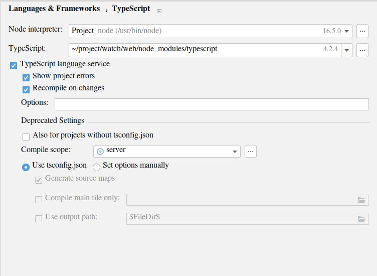

There are about 400-500 ts files in the project, but only `type_src/server` (with 160 ts files) has to be complied ts into js on save. The `dist` folder is the destination of server js output. I use webpack so I don't need the compile-on-save feature for the client code.

The `settings.zip` is the exported settings for the IDE.

